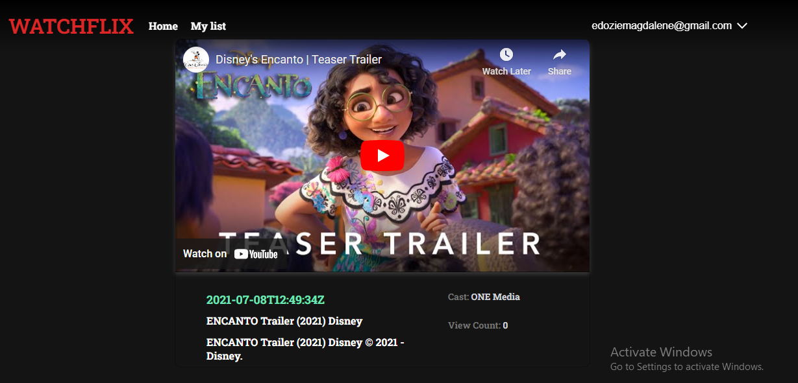

## Table of contents

- [Overview](#overview)
  - [Screenshot](#screenshot)
  - [Links](#links)
  - [Built with](#built-with)
  - [What I learned](#what-i-learned)
- [Author](#author)

## Overview
This is a cloned version of netflix application.
### Screenshot

### Links

- Youtube API dashboard :[https://console.cloud.google.com/apis/dashboard?project=watchflix-391307]

- Magic link [https://dashboard.magic.link/app?cid=QrSrfil1p_uJnUsVdSq5-YgTTpS6K86J1O22mREbY7o=]

- To generate test data from youtube data [https://developers.google.com/youtube/v3/docs/search/list?apix_params=%7B%22part%22%3A%5B%22snippet%22%5D%2C%22q%22%3A%22productivity%22%7]D
- Solution URL: [https://github.com/PrincessMaggy/movie-app.git]
- Live Site URL: [https://movie-app-eight-rust.vercel.app/]

### Built with

- NEXT JS 
- React JS
- CSS custom properties
- Framer motion
- Classnames
- Magic link for auth and login
- React Modal
- GraphQl

### What I learned
- ...

## Author

- Website - [Maggy](https://princessmaggy.github.io/My-Portfolio/)
- Frontend Mentor - [@Maggy](https://www.frontendmentor.io/profile/princessmaggy)
- Twitter - [@princessMaggy7](https://www.twitter.com/princessMaggy7)
